# Лабораторная работа №6
# Тихонов Виктор 4917

Цель лабораторной работы: изучение базовых возможностей системы управления версиями, опыт работы с Git Api, опыт работы с локальным и удаленным репозиторием. 

Создал аккаунт на GitHub
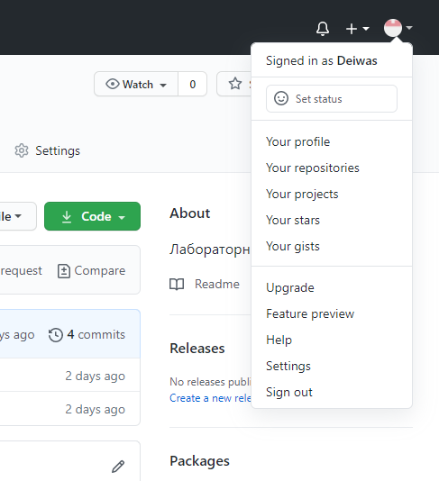

Установил систему контроля версий GUI
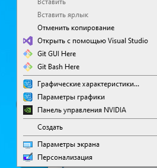

Добавил репозиторий https://github.com/Kurtyanik/LR6.git в свой репозиторий.
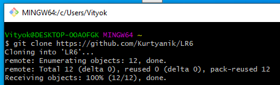

Получил историю операций для каждой ветки
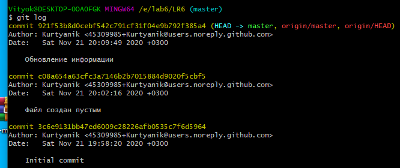
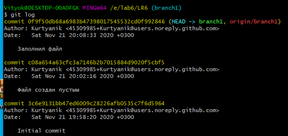

Объединение веток master и branch1 закончилось ошибкой.
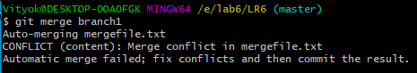

Так выглядит файл до исправления ошибки с помощью блокнота:
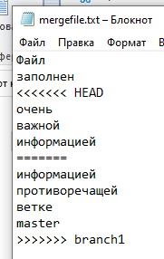

Так файл стал выглядеть после:
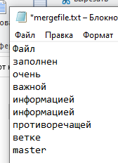

Удаляю побочную ветку
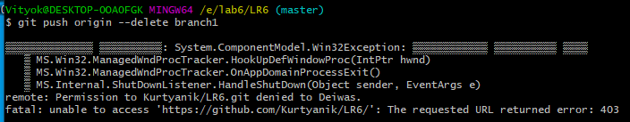

Переименовал файл README в AAA, после чего сделал "хард" откат коммита.
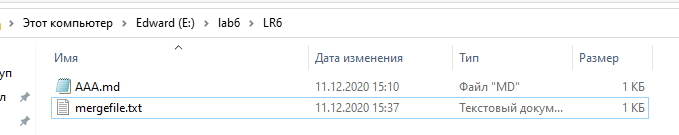

История использованных комманд
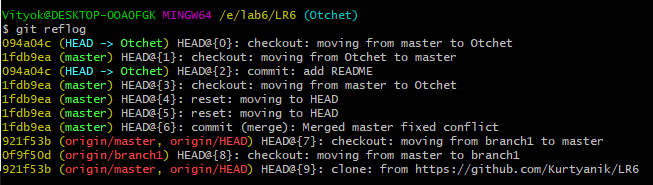

Вывод: изучил базовые возможности системы управления версиями Git Api, работу с локальным и удаленным репозиторием. 